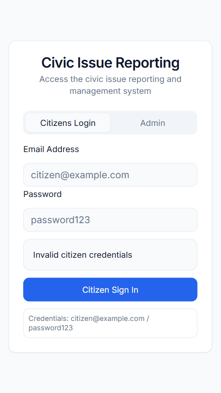
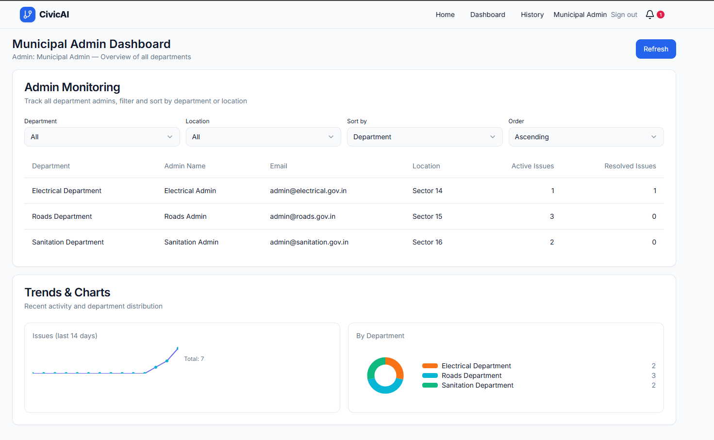
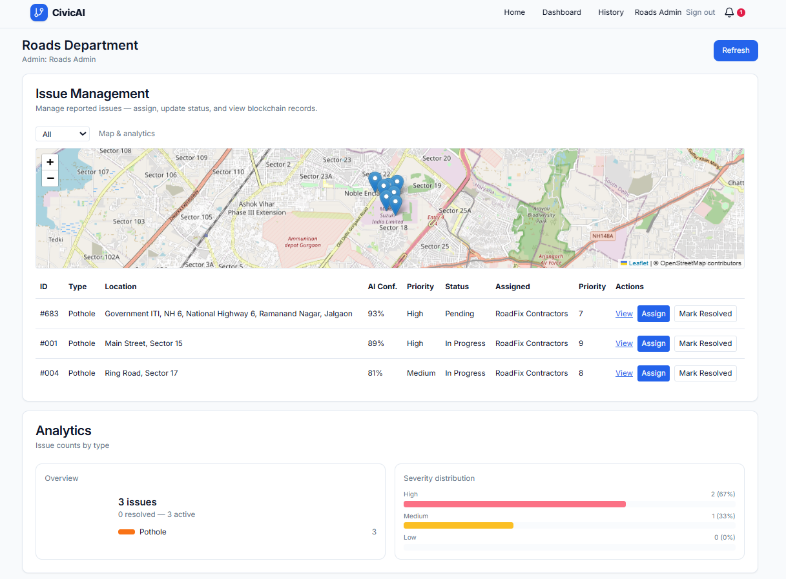

# CivicConnect - Smart City Issue Reporting System

A modern, full-stack web application for reporting and managing civic issues in smart cities. Built with React, TypeScript, and Express, featuring role-based access control for citizens and municipal administrators.

## 🚀 Features

### For Citizens
- **Issue Reporting**: Report civic issues with photos, location, and detailed descriptions
- **Real-time Tracking**: Track the status of reported issues in real-time
- **Interactive Map**: View issues on an interactive map with location markers
- **Marketplace**: Access civic services and resources
- **Personal History**: View your reported issues and their progress

### For Administrators
- **Department-wise Management**: Separate dashboards for different municipal departments
- **Issue Assignment**: Assign issues to available workers
- **Status Management**: Update issue status and track resolution progress
- **Analytics Dashboard**: View statistics and insights on civic issues
- **Worker Management**: Manage worker availability and assignments

### Departments Supported
- **Roads Department** - Road repairs, potholes, traffic issues
- **Electrical Department** - Street lights, power outages, electrical hazards
- **Sanitation Department** - Waste management, cleanliness issues
- **Municipal Administration** - Overall coordination and management

## 🛠️ Tech Stack

- **Frontend**: React 18 + TypeScript + Vite
- **Routing**: React Router 6 (SPA mode)
- **Styling**: TailwindCSS 3 + Radix UI components
- **Backend**: Express.js with TypeScript
- **State Management**: React Context + TanStack Query
- **Maps**: Leaflet.js for interactive mapping
- **Package Manager**: PNPM
- **Testing**: Vitest

## 📱 Screenshots

### Mobile Main Page

*Login interface for both citizens and administrators*

### Citizen Dashboard

*Interactive dashboard with issue reporting and map view*

### Municipal Admin Dashboard

*Administrative interface for managing civic issues across all departments*

### Departmental Admin Dashboard

*Department-specific admin interface for Roads, Electrical, and Sanitation departments*

## 🚦 Getting Started

### Prerequisites
- Node.js 18+ 
- PNPM (recommended) or npm

### Installation

1. **Clone the repository**
   ```bash
   git clone <repository-url>
   cd civic_sih
   ```

2. **Install dependencies**
   ```bash
   pnpm install
   ```

3. **Start development server**
   ```bash
   pnpm dev
   ```

4. **Open your browser**
   Navigate to `http://localhost:8080`

### Demo Credentials

#### Citizens
- **Email**: `citizen@example.com`
- **Password**: `password123`

#### Administrators
- **Roads**: `admin@roads.gov.in`
- **Electrical**: `admin@electrical.gov.in`  
- **Sanitation**: `admin@sanitation.gov.in`
- **Municipal**: `admin@municipal.gov.in`
- **Password**: `password123` (for all admin accounts)

## 📁 Project Structure

```
civic_sih/
├── client/                 # React frontend
│   ├── pages/             # Route components
│   │   ├── Index.tsx      # Login page
│   │   ├── Dashboard.tsx  # Citizen dashboard
│   │   ├── AdminDashboard.tsx # Admin dashboard
│   │   ├── Report.tsx     # Issue reporting
│   │   └── ...
│   ├── components/        # Reusable UI components
│   └── context/          # React context providers
├── server/               # Express backend
│   ├── index.ts         # Server configuration
│   └── routes/          # API endpoints
├── shared/              # Shared types and utilities
└── public/              # Static assets
```

## 🔧 Available Scripts

```bash
pnpm dev        # Start development server
pnpm build      # Build for production
pnpm start      # Start production server
pnpm test       # Run tests
pnpm typecheck  # TypeScript validation
```

## 🌟 Key Features Explained

### Role-Based Access Control
- **Citizens**: Can report issues, view their history, and access marketplace
- **Department Admins**: Manage issues specific to their department
- **Municipal Admin**: Oversee all departments and issues

### Real-time Updates
- Issues are updated in real-time across all connected clients
- Status changes are immediately reflected in the UI

### Interactive Mapping
- Leaflet.js integration for location-based issue reporting
- Visual markers for different types of issues
- Clustering for better performance with many issues

### Responsive Design
- Mobile-first approach with TailwindCSS
- Optimized for both desktop and mobile devices
- Touch-friendly interface elements

## 🚀 Deployment

### Development
The application runs on a single port (8080) with integrated frontend and backend.

### Production
```bash
pnpm build
pnpm start
```

### Cloud Deployment
Compatible with:
- **Netlify** - For static deployment
- **Vercel** - For full-stack deployment
- **Railway** - For containerized deployment

## 🤝 Contributing

1. Fork the repository
2. Create a feature branch (`git checkout -b feature/amazing-feature`)
3. Commit your changes (`git commit -m 'Add amazing feature'`)
4. Push to the branch (`git push origin feature/amazing-feature`)
5. Open a Pull Request

## 📄 License

This project is licensed under the MIT License - see the LICENSE file for details.

## 🆘 Support

For support and questions:
- Create an issue in the repository
- Contact the development team

---

**Built for Smart India Hackathon 2025**
